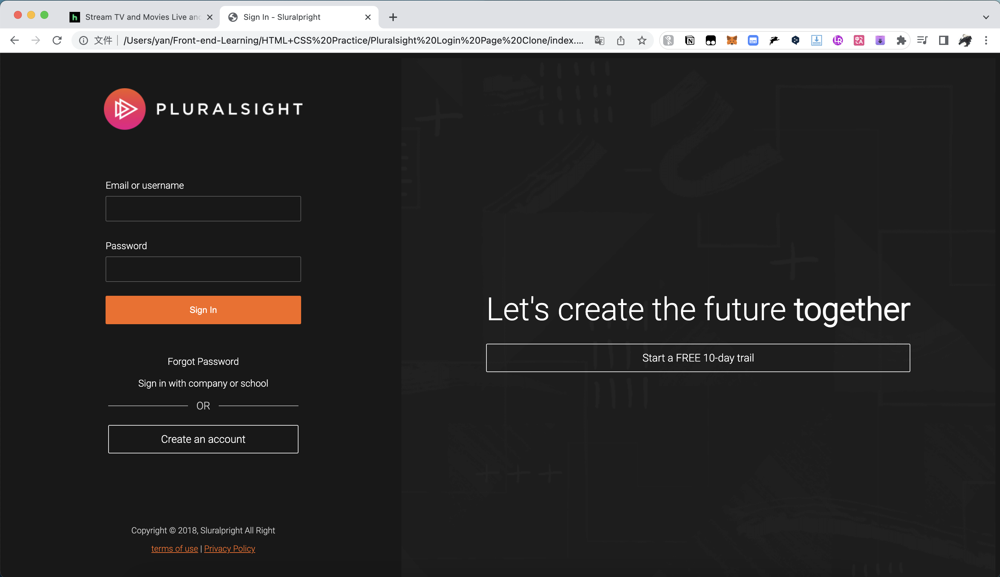

# HTML-CSS-Practice

This is an open-source project created on GitHub that consists of HTML and CSS clones of the login pages for Hulu, SpaceX, and Pluralsight. There is also a small amount of JavaScript included in some of the pages.

Project Structure
--
Each cloned login page is contained within its own folder, with the folder name corresponding to the website that it was cloned from. Within each folder, you will find an index.html file containing the HTML code for the page, a style.css file containing the CSS code, and sometimes a main.js file containing JavaScript code.

## Image Display

Usage
--
You are free to use this project for personal or educational purposes. If you wish to contribute to this project, please feel free to fork the repository, make changes, and submit a pull request.

Credits
--
Credit goes to the original creators of the login pages for Hulu, SpaceX, and Pluralsight. The code for the clones was written by monoyan, who is maintaining this open-source project.

License
--
This project is licensed under the MIT License.